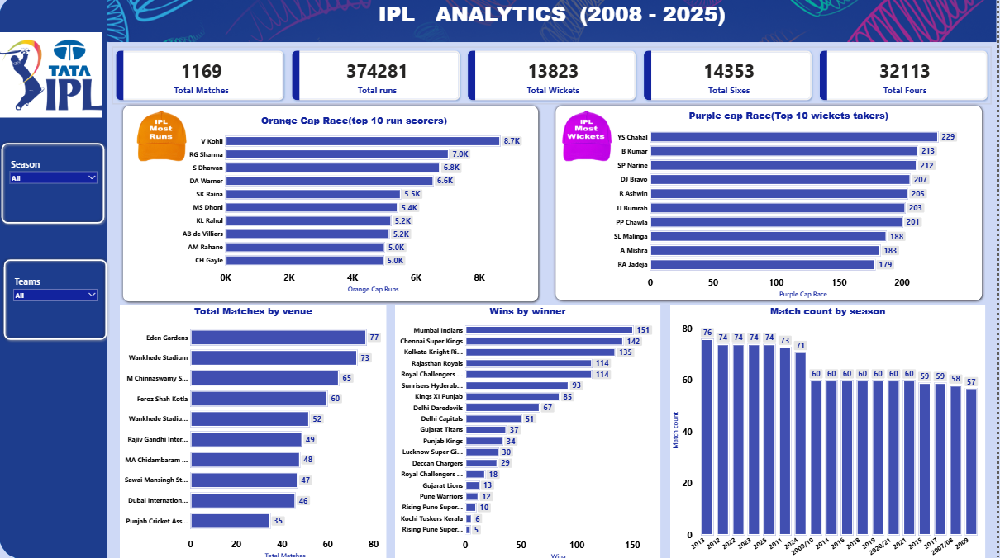

# 🏏 IPL Analytics Dashboard (2008–2025)

> An End-to-End Data Analytics Project built using **Python, MySQL, Power BI, Power Query, and DAX** to analyze IPL matches from 2008–2025.

---

## 📊 Dashboard Preview

### 🔹 Overview Dashboard

### 🔹 Team Comparison Dashboard

---

## 🚀 Project Overview

This project demonstrates a complete Data Analytics workflow, starting from raw IPL datasets to an interactive Power BI dashboard.

The project covers data cleaning, SQL database creation, KPI analysis, DAX measures, data modeling, and interactive dashboard development.

---

## 🛠 Tech Stack

- 🐍 Python
- 🗄 MySQL
- 📊 Power BI
- ⚡ Power Query
- 📈 DAX

---

## 📂 Dataset

- matches.csv
- deliveries.csv
- teams_logo.xlsx

---

## 📌 Workflow

Raw CSV Files

⬇

Python (Data Cleaning & Transformation)

⬇

MySQL Database

⬇

SQL Analysis

⬇

Power Query

⬇

Data Modeling

⬇

DAX Measures

⬇

Interactive Power BI Dashboard

---

## 📈 Dashboard Features

### 📌 Overview Dashboard

- Total Matches
- Total Runs
- Total Wickets
- Total Sixes
- Season-wise Analysis
- Orange Cap Analysis
- Purple Cap Analysis
- Venue Analysis
- Winner & Runner-up Team Logos

### 📌 Team Comparison Dashboard

- Team vs Team Comparison
- Dynamic Team Logos
- Head-to-Head Statistics
- Team Wins Comparison
- Toss Decision Analysis
- Venue Performance
- Match Details Table

---

## 💡 Key Insights

- Season-wise IPL performance
- Highest Run Scorers
- Highest Wicket Takers
- Venue-wise Match Distribution
- Team Head-to-Head Records
- Winner & Runner-up Analysis

---

## 📁 Project Structure

IPL-Analytics-Dashboard

├── Dashboard

│ └── IPL_Analytics_Dashboard.pbix

│

├── SQL

│ ├── Database_Creation.sql

│ ├── Data_Import.sql

│ └── KPI_Queries.sql

│

├── Python

│ ├── csv_to_mysql.py

│ ├── data_cleaning.py

│ └── requirements.txt

│

├── Dataset

│ ├── matches.csv

│ ├── deliveries.csv

│ └── teams_logo.xlsx

│

├── Images

│ ├── Dashboard_Page1.png

│ ├── Dashboard_Page2.png

│ └── Thumbnail.png

│

└── README.md

---

## 📷 Dashboard Screenshots

(Add your dashboard screenshots here)

---

## 🎯 Skills Demonstrated

- Data Cleaning
- SQL Query Writing
- Database Design
- Data Modeling
- DAX
- Power Query
- Dashboard Design
- Data Visualization

---

## 👨‍💻 Author

**Pankaj Jangir**

If you liked this project, don't forget to ⭐ the repository.
